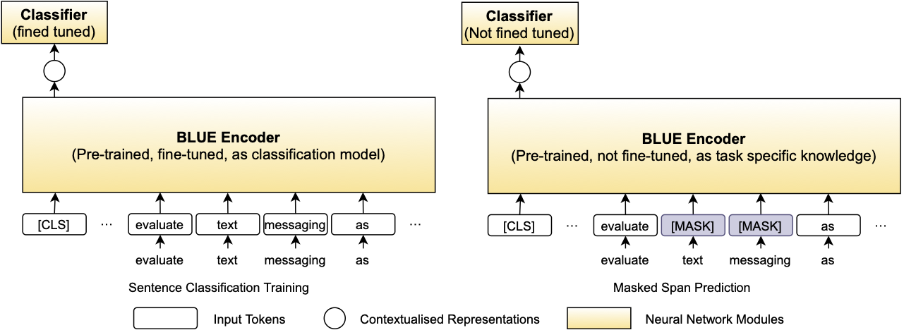
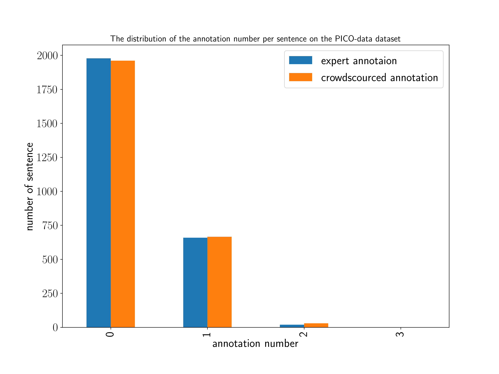
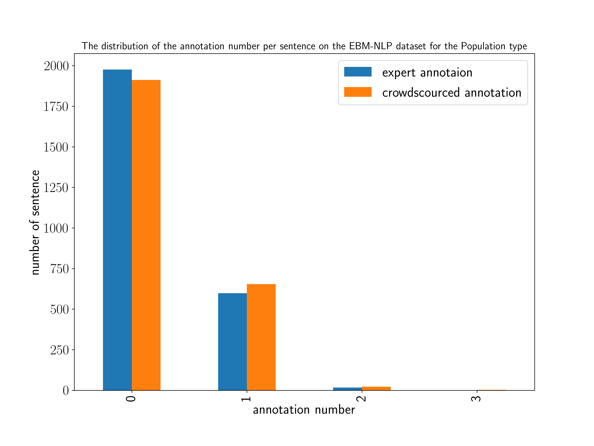
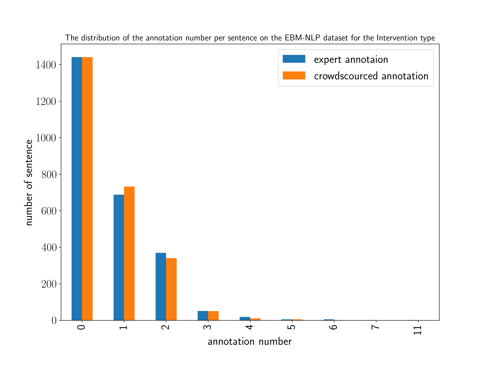
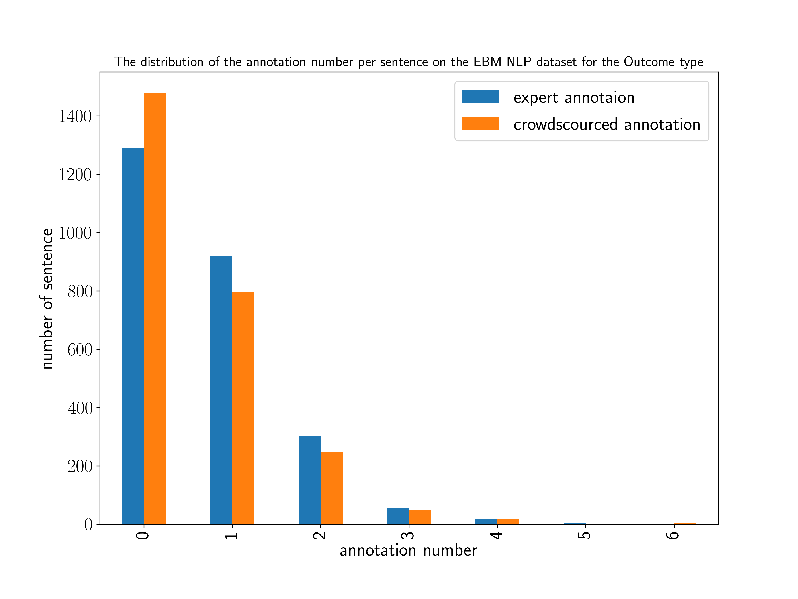

# Sent2Span

Sent2Span is a tool for PICO span detection.
Compared with previous methods, Sent2Span does not require span-level annotation data and uses
only crowdsourced sentence-level annotations.


## Model Structure

## Datasets
- [EBM-NLP](https://ebm-nlp.herokuapp.com/)
    
- [PICO-data](https://github.com/yinfeiy/PICO-data)

- Distribution of Annotation Number Per Sentence

|||
|-----|------|
|||

### Data Format
We prepross the datasets and store them in Json format with the following information.
We use [spaCy](https://spacy.io/) for tokenization.
```json
{"token": ["Effect", "of", "duloxetine", "on", "pain", ",", "function", ",", "and", "quality", "of", "life", "among", "patients", "with", "chemotherapy", "-", "induced", "painful", "peripheral", "neuropathy", ":", "a", "randomized", "clinical", "trial", ".", " "], "range": [0, 28], "groundtruth": [[13, 22]], "aggregation": [[13, 22]], "crowd": [["A33LYSCQQU1YDJ", 13, 22], ["A2FMLPZ0IF8G55", 13, 22], ["A1FYSH75E3MEHP", 15, 22], ["A1FGKIKJYSL1MI", 13, 22]], "sent_ground": true, "sent_agg": true, "sent_major": true, "sent_minor": true}

```
## Dependencies
This project is based on ```python==3.7.7```. The dependent package for this project is listed as below:
```
numpy==1.20.2
pytorch==1.8.0
transformers==4.4.2
tqdm==4.59.0
```

## Command
To train a sentence classification model as the first step in Sent2span, plase run
```
python main.py --corpus_path PATH/sent2span/data/pico_data/ \
               --output_path PATH/sent2span/exps/pubmed/pico/ \
               --label_name aggregation \
               --bert_name pubmed \
               --epochs 5 \
               --eval_metric f1 \
```

To get the final inference result as the second step in Sent2Span, please run
```
python mask_inference.py --corpus_path PATH/sent2span/data/pico_data/ \
                         --output_path PATH/sent2span/exps/pubmed/pico/ \
                         --label_name aggregation \
                         --bert_name pubmed \
                         --max_mask_len 20 \
```

## Citation
```
@inproceedings{liu2021sent2span,
    title = "Sent2Span: Span Detection for PICO Extraction in the Biomedical Text without Span Annotations",
    author = "Shifeng Liu, 
              Yifang Sun, 
              Bing Li, 
              Wei Wang, 
              Florence T. Bourgeois, 
              Adam G. Dunn",
    booktitle = "Findings of the Association for Computational Linguistics: EMNLP 2021",
    year = "2021",
}
```